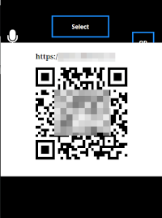

# WiFi-xlation
## Venue WiFi Audio Translation for mobile devices
A simultaneous audio translation system for venues using local WiFi and the web browser of mobile devices based on Web RTC. The server is packaged in a [Docker](https://www.docker.com/) utilising the the [Janus WebRTC Server](https://github.com/meetecho/janus-gateway), [Nginx web server](https://www.nginx.com/) and the [Debian slim Docker image](https://hub.docker.com/_/debian).

Any web browser can be used to send or receive the translation. The UI currently targets mobile devices to provide a simple, clear interface for language selection and reception.

A QR code can be popped up to share the translation URL around the venue.

Since WebRTC requires SSL to work beyond localhost facilities are provided in the Docker using [acme.sh](https://github.com/acmesh-official/acme.sh) to support [Let's Encrypt ](https://letsencrypt.org/) certificates using TXT DNS record domain verification.

A simple configuration file, languages.conf, contains the names of the language channels and corresponding passwords for the translators.

It is also possible to send audio to a channel using [Opus](https://opus-codec.org/) over RTP, for example, from [ffmpeg](https://ffmpeg.org/). This way, one channel can then be used to relay the on-stage sound to translators in different rooms of the venue.

Multiple translators can use the same channel simultaneously. This is so that they can hand over to each other without breaking the transmission. The translators on the same channel will be able to hear each other.

  

# Building

`docker build -t wifi-xlation .`

# Running

A helper bash script, xlationctl.sh, is provided to simplify, or just print out, common Docker commands for this application.

To run the application in localhost (WebRTC won't work beyond localhost without SSL):

`./xlationctl.sh start`

This will make the application available on `http://localhost`. If port 80 is already occupied on your host then this port can be shifted to, say, 8080:

`./xlationctl.sh start --portshift 8000`

To see what Docker command would be used for any combination of options just run with the `--dummy` switch. This will just print the Docker command rather than actually running it.

For the full range of options see:

`./xlationctl.sh --help`

# SSL
SSL certificates can be obtained from Let's Encrypt or existing certificates can be used. When using Let's Encrypt you will need to have control of the DNS entries for that domain in order to set the required TXT record. The first time that the Docker container is started acme.sh initiates a certificate request. The output from acme.sh will be displayed at `http://localhost/acme`. From here it is possible to find the TXT record that is required. Once the TXT record is set in your DNS entries and has propagated the container may be restarted and, all being well, the certificate will be applied.

It is probably a good idea to store the certificate and related files in a mounted directory so that the Docker container can be deleted and replaced without losing the certificate and related files. The xlationctl.sh script does this when executed with the Let's Encrypt options.

Once a Let's Encrypt certificate is issued it will renew automatically for as long as the container is running. This can be verified by checking `http://localhost/acme`.

## Further documentation

### [Docker Variables and Mount Points](src/doc/Docker%20variables%20and%20mount%20points.md)
